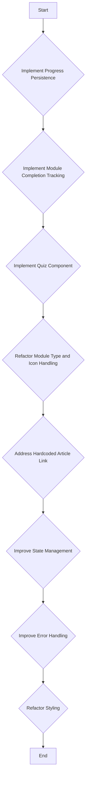

# Amazon Seller Academy Improvements Plan

## Overview

This document outlines a plan to improve the architecture, design, and implementation of the Amazon Seller Academy page (`src/app/academy/page.tsx`). The plan addresses several areas for improvement, including progress persistence, module completion tracking, quiz implementation, module type handling, article link flexibility, state management, error handling, and styling.

## Goals

- Implement progress persistence across sessions.
- Track module completion status and reflect it in the UI.
- Create a functional quiz component.
- Improve the maintainability and scalability of the module type and icon handling.
- Make the article link more flexible and configurable.
- Replace `localStorage` with a more robust state management solution.
- Provide more informative error messages and implement retry logic.
- Reduce duplicated styles and improve maintainability.

## Plan

1.  **Implement Progress Persistence:**

    - **Goal:** Persist course and module progress across sessions.
    - **Technology:** Use local storage to store user progress.
    - **Steps:**
      - Modify the `useAcademyStorage` hook to store and retrieve data from local storage.
      - Update the `startModule` function to update the local storage when a module is completed.
    - **Rationale:** Using local storage provides a simple way to persist data across sessions without the need for a database.

2.  **Implement Module Completion Tracking:**

        - **Goal:** Track module completion status and reflect it in the UI.

    :start_line:34

---

    - **Technology:** Use React state to manage module completion status during the current session, and update local storage when the user completes a module.
    - **Steps:**
      - Modify the `Module` type to include a `completed` property.
      - Update the `startModule` function to update the `completed` property in the React state and persist the change to local storage.
      - Update the `ModuleItem` component to visually indicate completed modules.
    - **Rationale:** Tracking module completion allows users to easily see their progress and pick up where they left off.

3.  **Implement Quiz Component:**

    - **Goal:** Create a functional quiz component.
    - **Technology:** React, potentially with a library for handling quiz logic (e.g., react-quiz).
    - **Steps:**
      - Create a new `Quiz` component that takes a list of questions as input.
      - Fetch quiz questions from an API endpoint or store them in a local file.
      - Implement logic to display questions, track user answers, and calculate the score.
      - Update the `ActiveCourseDisplay` component to render the `Quiz` component when `activeModule.type === 'quiz'`.
    - **Rationale:** Quizzes provide a way to assess user understanding and reinforce learning.

4.  **Refactor Module Type and Icon Handling:**

    - **Goal:** Improve the maintainability and scalability of the module type and icon handling.
    - **Technology:** TypeScript, React.
    - **Steps:**
      - Create a `ModuleType` enum to represent the different module types.
      - Modify the `Module` type to use the `ModuleType` enum for the `type` property.
      - Create a `ModuleIcon` component that takes a `ModuleType` as input and returns the appropriate icon.
      - Update the `ModuleItem` component to use the `ModuleIcon` component.
    - **Rationale:** Using an enum and a dedicated component for icon handling makes the code more readable, maintainable, and less prone to errors.

5.  **Address Hardcoded Article Link:**

    - **Goal:** Make the article link more flexible and configurable.
    - **Technology:** React.
    - **Steps:**
      - Add a `link` property to the `Module` type.
      - Update the `ActiveCourseDisplay` component to use the `link` property instead of hardcoding the `/blog` path.
    - **Rationale:** This allows for more flexibility in the types of modules that can be included in the course.

## :start_line:72

6.  **Improve State Management:**

- **Goal:** Improve state management.
- **Technology:** React Context.
- **Steps:**
  - Use React Context to manage the active course, active module, and course progress.
- **Rationale:** React Context provides a centralized and efficient way to manage application state.

7.  **Improve Error Handling:**

    - **Goal:** Provide more informative error messages and implement retry logic.
    - **Technology:** React, JavaScript.
    - **Steps:**
      - Update the `fetchCourses` function to display user-friendly error messages in the UI.
      - Implement retry logic with exponential backoff to handle transient network errors.
    - **Rationale:** Improved error handling makes the application more resilient and provides a better user experience.

8.  **Refactor Styling:**
    - **Goal:** Reduce duplicated styles and improve maintainability.
    - **Technology:** CSS Modules or a CSS-in-JS library (e.g., styled-components).
    - **Steps:**
      - Identify duplicated styles in the `ModuleItem` and `CourseList` components.
      - Create CSS Modules or styled-components to encapsulate these styles.
      - Update the components to use the CSS Modules or styled-components.
    - **Rationale:** Refactoring the styling makes the code more maintainable and reduces the risk of inconsistencies.

## Mermaid Diagram

