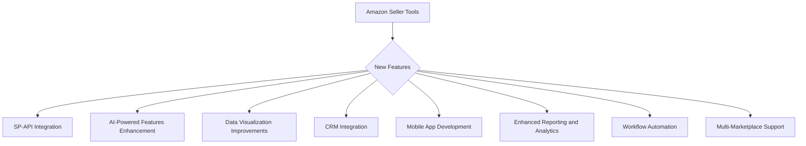

# Amazon Seller Tools - Feature Plan

## 1. Information Gathering

- Read relevant files:
  - [`src/app/amazon-seller-tools/page.tsx`](src/app/amazon-seller-tools/page.tsx) - Main page component
  - [`src/components/amazon-seller-tools/DataIntegrationHub.tsx`](src/components/amazon-seller-tools/DataIntegrationHub.tsx) - Data integration component
  - [`src/config/amazon-tools-config.ts`](src/config/amazon-tools-config.ts) - Configuration file
  - [`src/lib/amazon-tools/types.ts`](src/lib/amazon-tools/types.ts) - Type definitions
- Search for keywords: "TODO", "future", "enhance", "improve", and "feature" within the codebase.

## 2. Feature Identification and Description

Based on the file contents and search results, the following potential new features have been identified:

**1. SP-API Integration:**

- **Description:** Integrate with the Amazon Selling Partner API (SP-API) to fetch real-time data for various tools, such as the Sales Estimator, Competitor Analyzer, Keyword Trend Analyzer, Profit Margin Calculator, Product Score Calculator, PPC Campaign Auditor, and Description Editor.
- **Benefits:**
  - Automate data collection and reduce manual input.
  - Provide more accurate and up-to-date information.
  - Enable real-time analysis and decision-making.
- **Challenges/Considerations:**
  - SP-API requires authentication and authorization.
  - Rate limits and data usage restrictions may apply.
  - Handling API errors and data inconsistencies.

**2. AI-Powered Features Enhancement:**

- **Description:** Enhance the AI-powered features in the Listing Quality Checker, Description Editor, and Keyword Deduplicator.
- **Benefits:**
  - Improve the accuracy and effectiveness of the tools.
  - Provide more personalized and actionable recommendations.
  - Automate listing optimization and keyword management tasks.
- **Challenges/Considerations:**
  - Refining AI algorithms and prompts based on testing results.
  - Validating SEO recommendations.
  - Addressing potential biases and inaccuracies in AI-generated content.

**3. Data Visualization Improvements:**

- **Description:** Improve the data visualization capabilities of the Overview Dashboard and other tools.
- **Benefits:**
  - Provide more intuitive and insightful data representations.
  - Enable users to quickly identify trends and patterns.
  - Enhance the overall user experience.
- **Challenges/Considerations:**
  - Selecting appropriate chart types and visualization techniques.
  - Optimizing performance for large datasets.
  - Ensuring accessibility and responsiveness across different devices.

**4. Customer Relationship Management (CRM) Integration:**

- **Description:** Integrate with CRM systems to track customer interactions and improve customer service.
- **Benefits:**
  - Provide a more holistic view of customer data.
  - Enable personalized marketing and sales strategies.
  - Improve customer satisfaction and loyalty.
- **Challenges/Considerations:**
  - Integrating with different CRM systems.
  - Ensuring data privacy and security.
  - Managing customer data across multiple platforms.

**5. Mobile App Development:**

- **Description:** Develop a mobile app for the Amazon Seller Tools to provide access on the go.
- **Benefits:**
  - Enable users to monitor their business and manage their listings from anywhere.
  - Provide push notifications for important events and alerts.
  - Improve user engagement and accessibility.
- **Challenges/Considerations:**
  - Developing and maintaining mobile apps for different platforms (iOS and Android).
  - Ensuring data synchronization between the mobile app and the web application.
  - Optimizing performance for mobile devices.

**6. Enhanced Reporting and Analytics:**

- **Description:** Add more advanced reporting and analytics features to the Amazon Seller Tools.
- **Benefits:**
  - Provide users with deeper insights into their business performance.
  - Enable them to identify opportunities for improvement.
  - Support data-driven decision-making.
- **Challenges/Considerations:**
  - Identifying relevant metrics and KPIs.
  - Developing custom reports and dashboards.
  - Ensuring data accuracy and reliability.

**7. Workflow Automation:**

- **Description:** Implement workflow automation features to streamline common tasks and processes.
- **Benefits:**
  - Reduce manual effort and save time.
  - Improve efficiency and productivity.
  - Enable users to focus on more strategic activities.
- **Challenges/Considerations:**
  - Identifying and automating relevant workflows.
  - Designing a user-friendly interface for creating and managing workflows.
  - Ensuring compatibility with different tools and platforms.

**8. Multi-Marketplace Support:**

- **Description:** Expand the Amazon Seller Tools to support multiple Amazon marketplaces.
- **Benefits:**
  - Enable sellers to manage their business across different regions from a single platform.
  - Provide a global view of their business performance.
  - Simplify international expansion.
- **Challenges/Considerations:**
  - Handling different currencies, languages, and regulations.
  - Ensuring data consistency across different marketplaces.
  - Adapting the tools to meet the specific needs of each marketplace.

## 3. Feature Diagram

