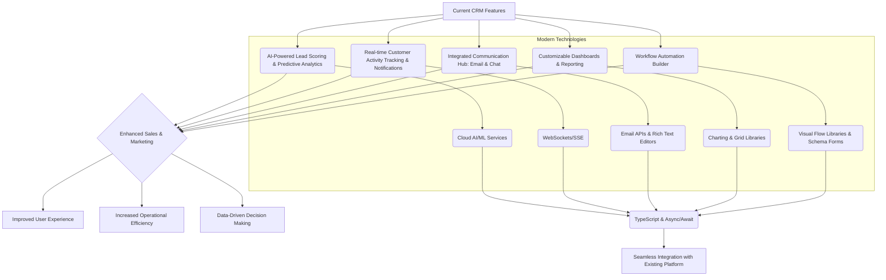

# Proposed Modern Features for ScaleSmart CRM

This document outlines a detailed plan for enhancing the ScaleSmart Platform's CRM with modern features, considering a balanced approach across different CRM areas.

### 1. AI-Powered Lead Scoring and Predictive Analytics

- **Purpose**: This feature will automatically assess the likelihood of a lead converting into a customer based on various data points. It will analyze historical data, customer interactions, demographic information, and behavioral patterns (e.g., website visits, email opens, form submissions) to assign a "lead score." Predictive analytics will also forecast sales trends and identify customers at risk of churn.
- **Enhancement**:
  - **Sales Efficiency**: Sales teams can prioritize high-potential leads, focusing their efforts where they are most likely to succeed, leading to improved conversion rates.
  - **Proactive Retention**: Identify at-risk customers early, allowing for proactive engagement and retention strategies.
  - **Data-Driven Decisions**: Provide insights into lead quality and sales forecasts, enabling better resource allocation and strategic planning.
- **Modern Language Features**:
  - Leverage `async/await` for efficient, non-blocking API calls to AI services.
  - Utilize strong TypeScript typing for defining input and output data models for AI predictions, ensuring data integrity and developer experience.
  - Potentially use decorators for logging AI service interactions or for data transformation before sending to AI models.
- **External Libraries**:
  - **Client-side Inference (for simpler models)**: [`TensorFlow.js`](https://www.tensorflow.org/js) or [`ONNX Runtime Web`](https://onnxruntime.ai/docs/tutorials/web/) for running pre-trained machine learning models directly in the browser, reducing server load and latency for certain tasks.
  - **Cloud AI Integration (for complex models)**: Integration with robust cloud-based AI/ML platforms like Google Cloud AI Platform, AWS SageMaker, or Azure Machine Learning for training and deploying more sophisticated predictive models.
  - **API Communication**: [`axios`](https://axios-http.com/) or the native `fetch` API for secure and efficient communication with backend AI services.

### 2. Real-time Customer Activity Tracking & Notifications

- **Purpose**: This feature will track customer interactions across all touchpoints in real-time, including website visits, email opens, form submissions, support ticket updates, and product usage. It will provide instant, configurable notifications to relevant sales, marketing, or support teams when critical customer actions occur.
- **Enhancement**:
  - **Timely Engagement**: Sales and marketing teams can react immediately to customer interest or disengagement, enabling highly relevant and timely outreach.
  - **Personalized Journeys**: Understand customer behavior as it happens, allowing for dynamic adjustments to personalized marketing campaigns and sales pitches.
  - **Improved Responsiveness**: Enhance customer support by alerting agents to urgent issues or recent customer activity.
- **Modern Language Features**:
  - Utilize WebSockets for persistent, bidirectional real-time communication between the client and server for instant updates.
  - Consider `EventSource` (Server-Sent Events) for simpler, unidirectional real-time data streams.
  - Employ `Proxy` objects in the frontend for reactive data updates, ensuring the UI reflects the latest customer activity without manual refreshes.
- **External Libraries**:
  - **Real-time Communication**: [`Socket.IO`](https://socket.io/) or the native `ws` library for WebSocket implementation on both client and server.
  - **Reactive Programming**: [`RxJS`](https://rxjs.dev/) for handling streams of events and managing complex notification logic.
  - **Notifications**: Continue using [`sonner`](https://sonner.emilkowalski.pl/) (already in use) or explore [`react-toastify`](https://fkhadra.github.io/react-toastify/) for displaying non-blocking, user-friendly notifications.

### 3. Integrated Communication Hub (Email & Chat)

- **Purpose**: Centralize all customer communication within the CRM. Users will be able to send and receive emails directly from the platform, manage email templates, and schedule email campaigns. Additionally, a live chat functionality will allow for real-time customer support and engagement.
- **Enhancement**:
  - **Streamlined Workflows**: Eliminate the need to switch between multiple applications for communication, saving time and improving efficiency.
  - **Complete Interaction History**: Maintain a comprehensive, chronological record of all customer communications within the CRM, providing a 360-degree view of each customer.
  - **Improved Collaboration**: Teams can easily view and contribute to customer conversations, ensuring consistent messaging and shared understanding.
- **Modern Language Features**:
  - Extensive use of `async/await` for handling email sending and receiving operations.
  - Leverage template literals for dynamic and flexible email content generation.
  - Utilize `Intl.DateTimeFormat` and other modern Date APIs for precise email scheduling and localization.
- **External Libraries**:
  - **Email Sending (Backend)**: [`Nodemailer`](https://nodemailer.com/about/) for server-side email sending, or integrate directly with transactional email service APIs like SendGrid, Mailgun, or AWS SES.
  - **Live Chat UI**: [`react-chat-widget`](https://www.npmjs.com/package/react-chat-widget) or similar React-based live chat components for a quick implementation of the chat interface.
  - **Rich Text Editing (for Email Templates)**: [`Draft.js`](https://draftjs.org/) or [`Quill`](https://quilljs.com/) for building a robust rich text editor for creating and managing email templates.

### 4. Customizable Dashboards & Reporting

- **Purpose**: Empower users to create personalized dashboards with drag-and-drop widgets, allowing them to visualize key CRM metrics relevant to their specific roles and objectives. This includes sales pipeline stages, lead sources, customer churn rates, communication volume, and more. Advanced reporting features will offer filtering, grouping, and drill-down capabilities.
- **Enhancement**:
  - **Actionable Insights**: Provide immediate, visual insights into CRM performance, enabling users to quickly identify trends, opportunities, and areas needing attention.
  - **User Empowerment**: Allow users to tailor their data views, fostering a sense of ownership and relevance to their daily tasks.
  - **Data-Driven Decision Making**: Support strategic and operational decisions with easily accessible and customizable data visualizations.
- **Modern Language Features**:
  - Efficient use of `Map` and `Set` data structures for optimized data aggregation and manipulation for reporting.
  - Employ optional chaining (`?.`) for safe access to potentially undefined data properties, improving code robustness.
  - Implement dynamic imports (`import()`) for lazy loading dashboard widgets and reporting components, improving initial page load performance.
- **External Libraries**:
  - **Dashboard Layout**: [`React Grid Layout`](https://github.com/react-grid-layout/react-grid-layout) for creating flexible, drag-and-drop grid layouts for dashboards.
  - **Data Visualization**: [`Recharts`](https://recharts.org/en-US/), [`Nivo`](https://nivo.rocks/), or [`Chart.js`](https://www.chartjs.org/) with [`react-chartjs-2`](https://react-chartjs-2.js.org/) for a wide range of interactive charts and graphs.
  - **Advanced Tables**: [`TanStack Table`](https://tanstack.com/table/v8) (formerly React Table) for building highly customizable and performant data tables with features like filtering, sorting, pagination, and column resizing.

### 5. Workflow Automation Builder (No-Code/Low-Code)

- **Purpose**: Provide a visual, no-code/low-code interface for users to define and automate complex CRM workflows. Users can set up triggers (e.g., "Lead status changes to 'Qualified'", "New communication log added") and corresponding actions (e.g., "Send follow-up email", "Create task for sales rep", "Update customer category").
- **Enhancement**:
  - **Automate Repetitive Tasks**: Significantly reduce manual effort for routine CRM operations, freeing up time for more strategic activities.
  - **Consistent Processes**: Ensure that sales, marketing, and support processes are consistently followed, reducing errors and improving compliance.
  - **Operational Efficiency**: Streamline operations across the CRM, leading to faster response times and improved overall productivity.
- **Modern Language Features**:
  - Utilize `Proxy` objects for reactive state management within the workflow builder, allowing for immediate visual feedback as users configure workflows.
  - Employ `WeakMap` for efficiently managing relationships between workflow nodes in a graph structure, preventing memory leaks.
  - Extensive use of `async/await` for executing workflow steps, especially when interacting with external services or performing database operations.
- **External Libraries**:
  - **Visual Workflow Editor**: [`React Flow`](https://reactflow.dev/) or [`GoJS`](https://gojs.net/) for building the interactive, drag-and-drop visual editor for designing workflows.
  - **Dynamic Form Generation (for Node Configuration)**: [`json-schema-form-core`](https://github.com/json-schema-form/json-schema-form-core) or [`react-jsonschema-form`](https://react-jsonschema-form.readthedocs.io/en/latest/) for dynamically generating forms based on JSON schemas for configuring individual workflow nodes.
  - **Schema Validation**: [`Zod`](https://zod.dev/) or [`Yup`](https://github.com/jquense/yup) for robust schema validation of workflow definitions, ensuring that automated processes are correctly configured.

### Integration Notes:

- **Seamless Integration**: All new features will be designed to integrate seamlessly with the existing ScaleSmart Platform architecture, leveraging existing data models and services where possible.
- **Consistency in UI/UX**: Adherence to the platform's existing design language and user experience guidelines will be paramount to ensure a cohesive and intuitive user interface.
- **Leverage Existing Infrastructure**: New features will utilize existing platform infrastructure for user authentication and authorization, data storage (e.g., IndexedDB, Supabase), and analytics, minimizing redundancy and maximizing efficiency.

### Plan Overview Diagram:

