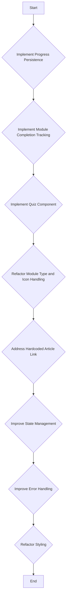
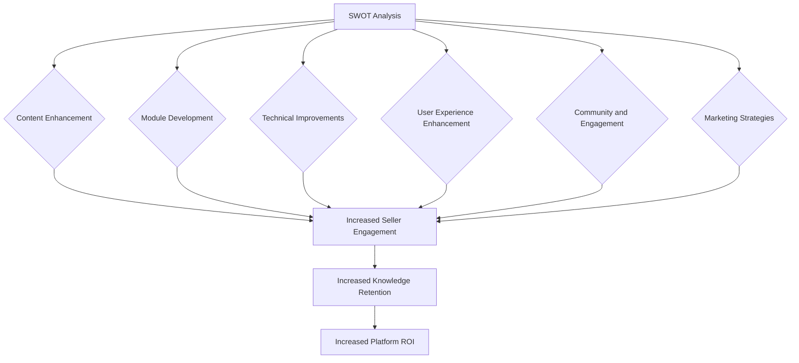

# ScaleSmart Academy Architecture

## Overview

This document outlines the architecture of the ScaleSmart Academy page (`src/app/academy/page.tsx`). It describes the key components and their responsibilities.

## Note:

- `We will only use User's Local Storage no Supabase Database for now. This rule cannot be changed until further notice.`

## Components

- **`src/app/academy/page.tsx`:**
  - Main entry point for the academy page.
  - Uses `AcademyProvider` to provide the academy context.
  - Renders the `AcademyContentClient` component.
- **`src/components/AcademyContentClient.tsx`:**
  - Displays the course list or the active course content.
  - Uses the `useAcademy` hook to access the academy context.
  - Uses the `useUserProfile` hook to access the user profile.
  - Uses `getRecommendedCourses` to display recommended courses.
  - Handles the `startCourse` function to set the active course and module.
  - Renders different module types based on the `activeModule.type`. Currently, it supports `article`, `video`, `exercise`, `caseStudy`, and `quiz` module types.
- **`src/hooks/use-academy-storage.ts`:**
  - Manages the local storage for academy data and provides export functionality.
  - Handles initialization, retrieval, and saving of data to `localStorage`.
  - Includes error handling, data validation.
- **`src/hooks/use-user-profile.ts`:**
  - Retrieves the user profile data.
- **`src/lib/course-recommendations.ts`:**
  - Contains the `getRecommendedCourses` function, which recommends courses based on the user profile.
- **`src/lib/types.ts`:**
  - Defines the types for `Module`, and other related interfaces.
- **`src/components/AcademyContentClient.tsx`:**
  - Defines the `Course` interface.
- **`src/context/AcademyContext.tsx`:**
  - Contains the `AcademyProvider` and the `useAcademy` hook, which manage the state related to the academy courses, active course, and active module.

## Goals

- Implement progress persistence across sessions.
- Track module completion status and reflect it in the UI.
- Create a functional quiz component.
- Improve the maintainability and scalability of the module type and icon handling.
- Make the article link more flexible and configurable.
- Improve state management.
- Improve error handling.
- Reduce duplicated styles and improve maintainability.

## Improvement Plan

**1. Enhance Content and Structure:**

- **Diversify Module Types:** Currently, modules seem to be either articles (linked via `contentSlug`) or quizzes. Introduce more interactive module types like videos, interactive exercises, or case studies.
- **Improve Quiz Component:**
  - Implement feedback for incorrect answers.
  - Add explanations for correct answers.
  - Allow for different question types (multiple choice, true/false, etc.).
  - Store quiz results and display them to the user.
- **Curriculum Enhancement:**
  - Add more courses and modules to cover a wider range of Amazon seller topics (e.g., product research, listing optimization, advertising strategies, inventory management).
  - Ensure the content is up-to-date and reflects the latest Amazon policies and best practices.
- **Personalized Learning Paths:**
  - Implement a system to recommend courses and modules based on the user's experience level and interests.
  - Allow users to track their progress and earn badges or certificates for completing courses.

**2. Improve User Experience:**

- **Mobile Responsiveness:** Ensure the academy is fully responsive and works well on all devices.
- **Accessibility:** Make the academy accessible to users with disabilities (e.g., provide alternative text for images, use semantic HTML).
- **Search Functionality:** Add a search bar to allow users to easily find specific courses or modules.
- **Progress Tracking:**
  - Visually display the user's progress within each course and module.
  - Use local storage (as per the architecture document) to persist progress across sessions.
- **Certificate Generation:**
  - Enable users to generate certificates upon completion of a course.
  - Consider integrating with a service like Credly to issue digital badges.

**3. Technical Improvements:**

- **State Management:** The architecture document mentions improving state management. Consider using a more robust state management solution like Redux or Zustand for complex interactions.
- **Error Handling:** Implement comprehensive error handling throughout the application.
- **Styling:** Refactor the styling to reduce duplication and improve maintainability (as mentioned in the architecture document). Consider using a CSS-in-JS solution like Styled Components or Emotion.
- **Types:** Ensure all components and data structures are properly typed using TypeScript.

**4. Community and Engagement:**

- **Discussion Forums:** Add discussion forums to allow users to ask questions and share their experiences.
- **Expert Q&A:** Host regular Q&A sessions with Amazon seller experts.
- **Case Studies:** Feature real-world case studies of successful Amazon sellers.

## Mermaid Diagram (unchanged from original plan)



---

The [`AcademyContentClient.tsx`](src/components/AcademyContentClient.tsx) component is responsible for displaying the course content based on the active course and module.

Key observations:

- **Course Recommendations:** It uses the `useUserProfile` hook and the `getRecommendedCourses` function to display recommended courses.
- **Module Types:** It renders different module types based on the `activeModule.type`, including `article`, `video`, `exercise`, `caseStudy`, `quiz`, and `simulation`.
- **Module Rendering:** It imports and renders specific components for `VideoModule`, `ExerciseModule`, `CaseStudyModule`, and `SimulationModule`. However, it only displays placeholder text for `article` and `quiz` modules.

Now I have a more complete picture of the ScaleSmart Academy platform. I can refine the SWOT analysis and develop actionable recommendations.

**SWOT Analysis (Updated):**

**Strengths:**

- Clear architecture and component structure.
- Existing courses covering various Amazon seller topics.
- Integration with Amazon Seller Tools.
- Support for different module types (video, exercise, case study, simulation).
- Personalized course recommendations based on user profile.

**Weaknesses:**

- Lack of detailed content in some courses (e.g., "Amazon PPC Mastery").
- Limited implementation of `article` and `quiz` modules (placeholder text only).
- Areas for improvement in state management, error handling, and styling.
- Reliance on local storage for progress tracking (potential data loss).

**Opportunities:**

- Expanding content offerings with more advanced courses (e.g., "Advanced Amazon PPC Strategies").
- Developing fully functional `article` and `quiz` modules with engaging content and interactive elements.
- Implementing a more robust state management solution (e.g., Redux, Zustand).
- Improving error handling and providing informative error messages to users.
- Enhancing the user interface and user experience with a focus on mobile responsiveness and accessibility.
- Fostering community and engagement through discussion forums and expert Q&A sessions.
- Exploring server-side storage options for progress tracking (e.g., Supabase).

**Threats:**

- Competition from other e-commerce education platforms.
- Changes in Amazon's policies and algorithms.
- Evolving seller needs and expectations.
- Potential data loss due to reliance on local storage.

**Actionable Recommendations:**

Based on the SWOT analysis, here are actionable recommendations for improving the ScaleSmart Academy platform:

1.  **Content Enhancement:**
    - Develop detailed content for existing courses that lack depth, such as the "Amazon PPC Mastery" course.
    - Create new courses on advanced topics, such as "Advanced Amazon PPC Strategies," as outlined in the [`academy_curriculum_enhancement_plan.md`](docs/academy/academy_curriculum_enhancement_plan.md) file.
    - Ensure all content is up-to-date and reflects the latest Amazon policies and best practices.
2.  **Module Development:**
    - Implement fully functional `article` and `quiz` modules with engaging content and interactive elements.
    - For `article` modules, consider using the [`MdxRenderer`](src/components/MdxRenderer.tsx) component to render Markdown content with interactive elements.
    - For `quiz` modules, provide feedback for incorrect answers, explanations for correct answers, and support for different question types (multiple choice, true/false, etc.).
3.  **Technical Improvements:**
    - Evaluate and implement a more robust state management solution like Redux or Zustand to improve the maintainability and scalability of the application.
    - Implement comprehensive error handling throughout the application and provide informative error messages to users.
    - Refactor the styling to reduce duplication and improve maintainability. Consider using a CSS-in-JS solution like Styled Components or Emotion.
    - Explore server-side storage options for progress tracking, such as Supabase, to prevent data loss and enable cross-device synchronization.
4.  **User Experience Enhancement:**
    - Ensure the academy is fully responsive and works well on all devices.
    - Make the academy accessible to users with disabilities (e.g., provide alternative text for images, use semantic HTML).
    - Add a search bar to allow users to easily find specific courses or modules.
    - Visually display the user's progress within each course and module.
    - Enable users to generate certificates upon completion of a course.
5.  **Community and Engagement:**
    - Add discussion forums to allow users to ask questions and share their experiences.
    - Host regular Q&A sessions with Amazon seller experts.
    - Feature real-world case studies of successful Amazon sellers.
6.  **Marketing Strategies:**
    - Implement targeted marketing campaigns to reach specific segments of Amazon sellers.
    - Offer incentives for completing courses, such as discounts on Amazon Seller Tools or access to exclusive content.
    - Promote the academy through social media, email marketing, and other channels.

**Metrics for Measuring Effectiveness:**

To measure the effectiveness of the proposed changes, track the following metrics:

- **Seller Engagement:**
  - Number of active users
  - Course completion rate
  - Module completion rate
  - Time spent on platform
  - Forum participation rate
- **Knowledge Retention:**
  - Quiz scores
  - Survey results
  - Case study performance
- **Platform ROI:**
  - Increase in seller sales
  - Increase in seller profitability
  - Reduction in seller errors
  - Positive feedback from sellers

By implementing these recommendations and tracking the defined metrics, the ScaleSmart Academy platform can significantly increase seller engagement, knowledge retention, and ultimately, seller success and platform ROI.



```xml

```
