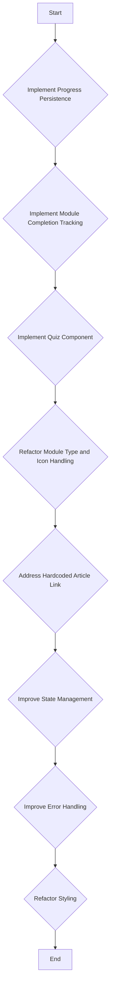

# Amazon Seller Academy Architecture

## Overview

This document outlines the architecture of the Amazon Seller Academy page (`src/app/academy/page.tsx`). It describes the key components and their responsibilities.

## Note:

- `We will only use User's Local Storage no Supabase Database for now. This rule cannot be changed until further notice.`

## Components

- **`src/app/academy/page.tsx`:**
  - Main entry point for the academy page.
  - Uses `AcademyProvider` to provide the academy context.
  - Renders the `AcademyContentClient` component.
- **`src/components/AcademyContentClient.tsx`:**
  - Displays the course list or the active course content.
  - Uses the `useAcademy` hook to access the academy context.
  - Uses the `useUserProfile` hook to access the user profile.
  - Uses `getRecommendedCourses` to display recommended courses.
  - Handles the `startCourse` function to set the active course and module.
  - Renders different module types based on the `activeModule.type`. Currently, it supports `article`, `video`, `exercise`, `caseStudy`, and `quiz` module types.
- **`src/hooks/use-academy-storage.ts`:**
  - Manages the local storage for academy data and provides export functionality.
  - Handles initialization, retrieval, and saving of data to `localStorage`.
  - Includes error handling, data validation.
- **`src/hooks/use-user-profile.ts`:**
  - Retrieves the user profile data.
- **`src/lib/course-recommendations.ts`:**
  - Contains the `getRecommendedCourses` function, which recommends courses based on the user profile.
- **`src/lib/types.ts`:**
  - Defines the types for `Course`, `Module`, and other related interfaces.
- **`src/context/AcademyContext.tsx`:**
  - Contains the `AcademyProvider` and the `useAcademy` hook, which manage the state related to the academy courses, active course, and active module.

## Goals

- Implement progress persistence across sessions.
- Track module completion status and reflect it in the UI.
- Create a functional quiz component.
- Improve the maintainability and scalability of the module type and icon handling.
- Make the article link more flexible and configurable.
- Improve state management.
- Improve error handling.
- Reduce duplicated styles and improve maintainability.

## Improvement Plan

**1. Enhance Content and Structure:**

- **Diversify Module Types:** Currently, modules seem to be either articles (linked via `contentSlug`) or quizzes. Introduce more interactive module types like videos, interactive exercises, or case studies.
- **Improve Quiz Component:**
  - Implement feedback for incorrect answers.
  - Add explanations for correct answers.
  - Allow for different question types (multiple choice, true/false, etc.).
  - Store quiz results and display them to the user.
- **Curriculum Enhancement:**
  - Add more courses and modules to cover a wider range of Amazon seller topics (e.g., product research, listing optimization, advertising strategies, inventory management).
  - Ensure the content is up-to-date and reflects the latest Amazon policies and best practices.
- **Personalized Learning Paths:**
  - Implement a system to recommend courses and modules based on the user's experience level and interests.
  - Allow users to track their progress and earn badges or certificates for completing courses.

**2. Improve User Experience:**

- **Mobile Responsiveness:** Ensure the academy is fully responsive and works well on all devices.
- **Accessibility:** Make the academy accessible to users with disabilities (e.g., provide alternative text for images, use semantic HTML).
- **Search Functionality:** Add a search bar to allow users to easily find specific courses or modules.
- **Progress Tracking:**
  - Visually display the user's progress within each course and module.
  - Use local storage (as per the architecture document) to persist progress across sessions.
- **Certificate Generation:**
  - Enable users to generate certificates upon completion of a course.
  - Consider integrating with a service like Credly to issue digital badges.

**3. Technical Improvements:**

- **State Management:** The architecture document mentions improving state management. Consider using a more robust state management solution like Redux or Zustand for complex interactions.
- **Error Handling:** Implement comprehensive error handling throughout the application.
- **Styling:** Refactor the styling to reduce duplication and improve maintainability (as mentioned in the architecture document). Consider using a CSS-in-JS solution like Styled Components or Emotion.
- **Types:** Ensure all components and data structures are properly typed using TypeScript.

**4. Community and Engagement:**

- **Discussion Forums:** Add discussion forums to allow users to ask questions and share their experiences.
- **Expert Q&A:** Host regular Q&A sessions with Amazon seller experts.
- **Case Studies:** Feature real-world case studies of successful Amazon sellers.

## Mermaid Diagram (unchanged from original plan)

