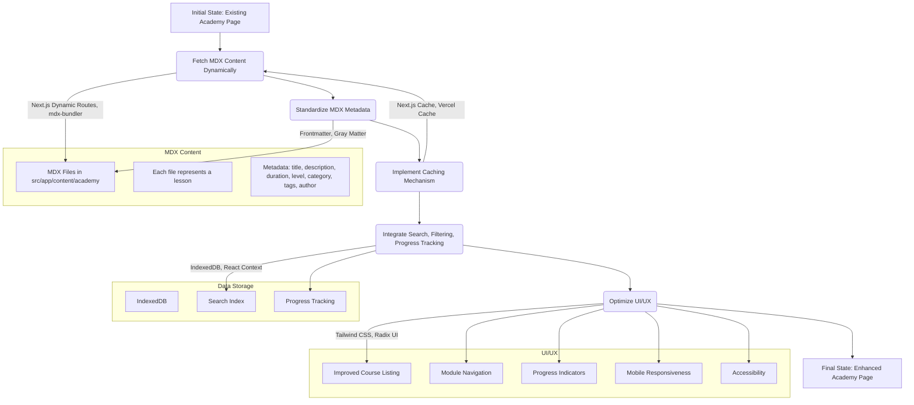

# Academy Page Enhancement Plan

## 1. Introduction

This document outlines a detailed plan for implementing enhancements to the `/academy` page, which aims to fetch and display course module articles from the MDX files located in `src/app/content/academy`. The enhancements include:

1.  Implementing a mechanism to fetch and display MDX content dynamically.
2.  Standardizing the metadata format and content structure of the MDX files.
3.  Implementing a caching mechanism for the MDX content.
4.  Integrating new features such as search, filtering, and progress tracking.
5.  Optimizing existing features such as the UI and content organization.

## 2. Overall Architecture

## 3. Detailed Plan

**Phase 1: Content Fetching and Metadata Standardization (Estimated Time: 1 week)**

- **Description:** This phase focuses on fetching MDX content dynamically and standardizing the metadata format. The `/api/academy-courses` endpoint fetches MDX files from the `src/app/content/academy` directory, parses the metadata using `gray-matter`, and returns the data as a JSON response. The standardized metadata format includes required fields such as title, description, and modules, as well as optional fields.
- **Steps:**
  1.  **Content Fetching:**
      - Implement dynamic MDX content fetching using Next.js dynamic routes. The `/api/academy-courses` endpoint fetches MDX files from the `src/app/content/academy` directory.
      - Use `gray-matter` to parse the MDX files and extract the metadata.
  2.  **Metadata Standardization:**
      - Define a standardized metadata format for the MDX files, including required fields such as title, description, and modules, as well as optional fields.
      - Update the existing MDX files in `src/app/content/academy` to conform to the new metadata format.

**Phase 2: Caching Mechanism (Estimated Time: 3 days)**

- **Description:** This phase focuses on implementing a caching mechanism for the MDX content. The `Cache-Control` header is used to implement a caching mechanism for the MDX content.
- **Steps:**
  - Implement a caching mechanism for the MDX content using the `Cache-Control` header in the `/api/academy-courses` endpoint.
  - Configure the cache to invalidate when the MDX files are updated.

**Phase 3: UI/UX Optimization (Estimated Time: 1 week)**

## 4. Technologies and Libraries

- Next.js
- mdx-bundler or gray-matter
- fuse.js or algolia
- Tailwind CSS
- Radix UI
- IndexedDB

## 5. Dependencies and Potential Conflicts

- Potential conflicts with existing components that rely on the current course data structure.
- Ensure compatibility with the existing UI framework (Tailwind CSS and Radix UI).

## 6. Scalability and Maintainability

- Use a modular architecture to ensure scalability and maintainability.
- Write unit tests to ensure the correctness of the code.
- Document the code thoroughly.

## 7. Prioritization

1.  Content Fetching and Metadata Standardization
2.  Caching Mechanism
3.  UI/UX Optimization

## 8. Resource Allocation

- 1-2 developers
- 1 designer
