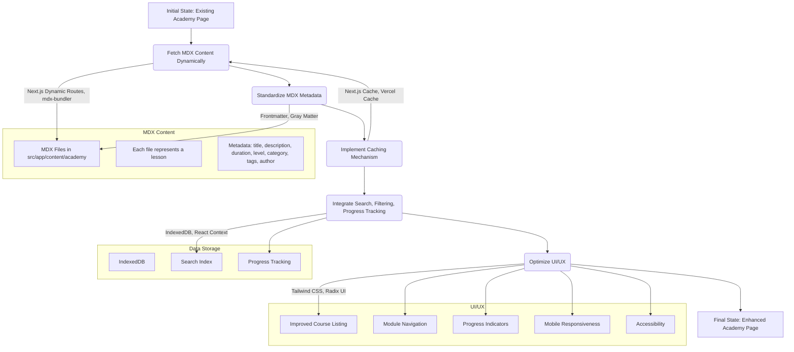

# Academy Page Enhancement Plan

## 1. Introduction

This document outlines a detailed plan for implementing enhancements to the `/academy` page, which aims to fetch and display course module articles from the MDX files located in `src/app/content/academy`. The enhancements include:

1.  Implementing a mechanism to fetch and display MDX content dynamically.
2.  Standardizing the metadata format and content structure of the MDX files.
3.  Implementing a caching mechanism for the MDX content.
4.  Integrating new features such as search, filtering, and progress tracking.
5.  Optimizing existing features such as the UI and content organization.

## 2. Overall Architecture

## 3. Detailed Plan

**Phase 1: Content Fetching and Metadata Standardization (Estimated Time: 1 week)**

- **Step 1.1:** Implement dynamic MDX content fetching using Next.js dynamic routes. This will involve modifying the `/academy/[slug]/page.tsx` file to fetch MDX files based on the slug.
- **Step 1.2:** Use a library like `mdx-bundler` or `gray-matter` to parse the MDX files and extract the metadata.
- **Step 1.3:** Define a standardized metadata format for the MDX files, including title, description, duration, level, category, tags, and author.
- **Step 1.4:** Update the existing MDX files in `src/app/content/academy` to conform to the new metadata format.

**Phase 2: Caching Mechanism (Estimated Time: 3 days)**

- **Step 2.1:** Implement a caching mechanism for the MDX content using Next.js' built-in caching features or a dedicated caching library like `Vercel Cache`.
- **Step 2.2:** Configure the cache to invalidate when the MDX files are updated.

**Phase 3: Feature Integration (Estimated Time: 2 weeks)**

- **Step 3.1:** Implement search functionality using a library like `fuse.js` or `algolia`. The search index will be stored in IndexedDB.
- **Step 3.2:** Implement filtering functionality based on category, level, and tags.
- **Step 3.3:** Implement progress tracking using IndexedDB to store the user's progress for each module.
- **Step 3.4:** Update the UI to display the search, filtering, and progress tracking features.

**Phase 4: UI/UX Optimization (Estimated Time: 1 week)**

- **Step 4.1:** Improve the course listing and module navigation using Tailwind CSS and Radix UI components.
- **Step 4.2:** Add progress indicators and visual feedback to the UI.
- **Step 4.3:** Ensure mobile responsiveness and accessibility by using responsive design principles and ARIA attributes.

## 4. Technologies and Libraries

- Next.js
- mdx-bundler or gray-matter
- fuse.js or algolia
- Tailwind CSS
- Radix UI
- IndexedDB

## 5. Dependencies and Potential Conflicts

- Potential conflicts with existing components that rely on the current course data structure.
- Ensure compatibility with the existing UI framework (Tailwind CSS and Radix UI).

## 6. Scalability and Maintainability

- Use a modular architecture to ensure scalability and maintainability.
- Write unit tests to ensure the correctness of the code.
- Document the code thoroughly.

## 7. Prioritization

1.  Content Fetching and Metadata Standardization
2.  Caching Mechanism
3.  Feature Integration
4.  UI/UX Optimization

## 8. Resource Allocation

- 1-2 developers
- 1 designer
