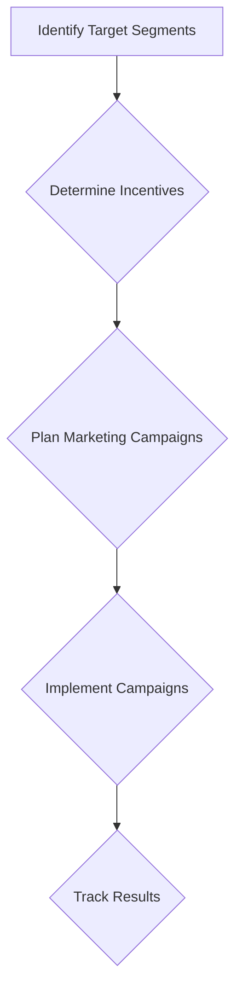

# Amazon Seller Academy Marketing Plan

## 1. Target Segments

- Experienced Amazon sellers who have a solid understanding of PPC fundamentals and are looking to scale their campaigns and maximize profitability.
- New Amazon sellers who are just getting started with their businesses.
- Amazon sellers who are interested in brand registry and protection.
- Amazon sellers who are interested in product research and validation.

## 2. Incentives

- Discounts on Amazon Seller Tools (e.g., PPC Campaign Auditor, keyword research tools).
- Access to exclusive content (e.g., advanced PPC strategies course).
- Personalized learning paths.
- Badges and certifications for completing courses.

## 3. Marketing Campaigns

- **Social media:** Create content that is relevant to the target segments and promotes the Academy's courses and incentives.
- **Email marketing:** Send targeted emails to Amazon sellers based on their interests and experience level.
- **Other channels:** Explore other channels such as Amazon Seller Forums, webinars, and partnerships with Amazon seller communities.

## 4. Implementation

- Create social media posts, email templates, and other marketing materials.
- Set up ads on social media and other platforms.
- Send emails to targeted segments of Amazon sellers.

## 5. Tracking

- Track the number of course enrollments, website visits, and social media engagement.
- Measure the effectiveness of different marketing channels and campaigns.
- Adjust the marketing plan based on the results.

## Mermaid Diagram

