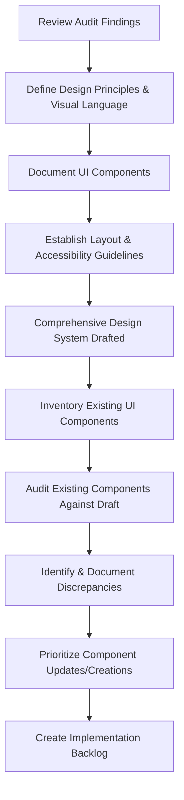

# ScaleSmart Platform Design System Plan

## Goal

To establish a comprehensive and consistent design system for the ScaleSmart Platform to improve visual design, enhance user experience, and accelerate future development.

## Key Components and Guidelines

The design system will document and provide guidelines for the following core elements:

1.  **Principles:** Define the foundational design principles guiding the system (e.g., Consistency, Clarity, Accessibility, Efficiency, Responsiveness as outlined in the UI/UX plan).
2.  **Brand Identity:**
    - **Logo Usage:** Guidelines for using the ScaleSmart logo.
    - **Brand Voice:** Tone and language guidelines for UI text.
3.  **Visual Language:**
    - **Color Palette:** Define primary, secondary, accent, semantic (success, warning, error, info), and neutral colors. Specify usage rules and accessibility considerations (contrast ratios).
    - **Typography:** Define font families, sizes, weights, line heights, and spacing for headings, body text, and other text elements. Establish a typographic scale.
    - **Iconography:** Define the style, size, and usage of icons. Specify the icon library or creation process.
    - **Spacing:** Define a consistent spacing scale (e.g., using a base unit like 4px or 8px) for margins, padding, and layout.
    - **Elevation/Shadows:** Define consistent styles for shadows and elevation to indicate hierarchy and depth.
    - **Borders and Dividers:** Define styles for borders and dividers used in components and layouts.
4.  **UI Components:**
    - Define and document a library of reusable UI components (e.g., Buttons, Forms (Input fields, checkboxes, radio buttons, dropdowns), Navigation elements (Tabs, breadcrumbs, menus), Data Display (Tables, cards, lists), Feedback mechanisms (Toasts, alerts, modals), Loaders, Avatars, Badges, Tooltips).
    - Each component documentation should include:
      - Description and purpose.
      - Variations and states (e.g., default, hover, active, disabled, error).
      - Usage guidelines and best practices.
      - Code examples (if applicable in the implementation phase).
5.  **Layout and Grid:** Define responsive grid systems and layout patterns for different screen sizes.
6.  **Accessibility:** Provide guidelines for designing and implementing accessible components and layouts (e.g., keyboard navigation, ARIA attributes, color contrast).
7.  **Motion and Animation:** Define principles and examples for UI animations and transitions.

## Strategy for Auditing Existing UI Components

1.  **Inventory:** Create a comprehensive inventory of all existing UI components currently used across the ScaleSmart Platform. This can involve manually reviewing pages or using automated tools if available.
2.  **Audit Against Draft System:** Compare each inventoried component against the defined guidelines and specifications in the draft design system.
3.  **Identify Discrepancies:** Document all inconsistencies, deviations, and areas where existing components do not align with the design system.
4.  **Categorize and Prioritize:** Categorize the identified components based on the type of change needed (e.g., minor style tweak, significant refactor, new component creation). Prioritize the components for update or creation based on factors like frequency of use, impact on user experience, and complexity.
5.  **Create Backlog:** Generate a backlog of tasks for updating or creating components based on the audit findings and prioritization.

## Summary of the Plan

The plan involves defining the core principles and visual language of the design system, documenting a comprehensive library of reusable UI components with detailed guidelines, and implementing a systematic audit process to identify and prioritize existing components for refinement or replacement based on the new design system.

## Process Flow

