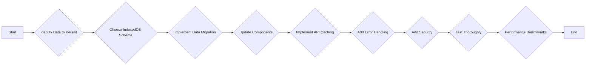

# Client-Side Storage Documentation

## Overview

This document outlines a plan for integrating IndexedDB as a persistent storage solution, focusing on areas where client-side data persistence would improve performance, reduce server load, or enable offline functionality.

## Goals

- Improve application performance by caching data in IndexedDB.
- Reduce server load by minimizing the number of requests for data.
- Enable offline functionality for key features.

## Analysis

The following components and data are suitable for storing in IndexedDB:

- **Chat Messages:**
  - Component: [`src/components/ui/chat-interface.tsx`](src/components/ui/chat-interface.tsx)
  - Data: Chat messages
  - Current Storage: `localStorage`
  - Proposed Solution: Migrate chat messages to IndexedDB.
  - Schema:
    - Object Store: `chatMessages`
    - Key Path: `timestamp`
    - Indexes: `userId`, `conversationId`
- **Workflow Data:**
  - Component: [`src/app/workflow-builder/page.tsx`](src/app/workflow-builder/page.tsx)
  - Data: Workflow nodes and edges
  - Current Storage: `localStorage`
  - Proposed Solution: Migrate workflow data to IndexedDB.
  - Schema:
    - Object Store: `workflows`
    - Key Path: `workflowId`
    - Indexes: `userId`, `name`
- **Course Data:**
  - Component: [`src/app/academy/SchoolComponent.tsx`](src/app/academy/SchoolComponent.tsx)
  - Data: Course list
  - Current Storage: `localStorage`
  - Proposed Solution: Migrate course data to IndexedDB.
  - Schema:
    - Object Store: `courses`
    - Key Path: `id`
    - Indexes: `name`, `category`
- **Amazon Seller Tools Data:**
  - Component: [`src/components/amazon-seller-tools/competitor-analyzer.tsx`](src/components/amazon-seller-tools/competitor-analyzer.tsx)
  - Data: Competitor analysis results
  - Current Storage: `sessionStorage`
  - Proposed Solution: Migrate competitor analysis results to IndexedDB.
  - Schema:
    - Object Store: `competitorAnalysis`
    - Key Path: `id`
    - Indexes: `asin`, `timestamp`
- **API Data Caching:**
  - Components: Various components that use `fetch`
  - Data: API responses
  - Current Storage: None (data is fetched on demand)
  - Proposed Solution: Implement a generic caching mechanism using IndexedDB to store API responses.
  - Schema:
    - Object Store: `apiCache`
    - Key Path: `url`
    - Indexes: `timestamp`

## Implementation Plan

1.  **Create a service for managing IndexedDB:** This service will handle database initialization, schema creation, and data access.
2.  **Implement data migration:** Migrate existing data from `localStorage` and `sessionStorage` to IndexedDB.
3.  **Update components to use the IndexedDB service:** Replace `localStorage` and `sessionStorage` calls with calls to the IndexedDB service.
4.  **Implement API data caching:** Intercept `fetch` calls and check if the data is already in the cache. If it is, return the cached data. Otherwise, fetch the data from the server, store it in the cache, and return it.
5.  **Add error handling:** Handle errors that may occur during IndexedDB operations.
6.  **Add security:** Encrypt sensitive data before storing it in IndexedDB.
7.  **Test thoroughly:** Test all components to ensure that they are working correctly with IndexedDB.
8.  **Performance benchmarks:** Measure the performance of the application before and after integrating IndexedDB to ensure that it is improving performance.

## Mermaid Diagram

