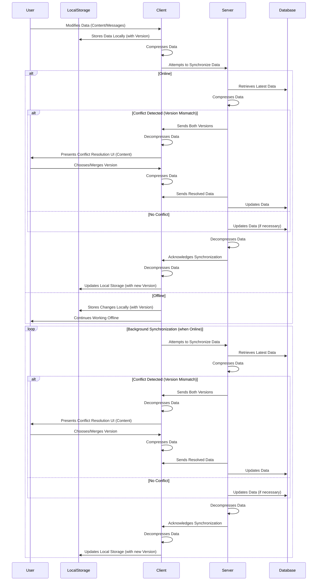

# Synchronization Strategy

This strategy focuses on synchronizing user-generated content and chat messages between IndexedDB and a server, targeting both web and mobile platforms.

## 1. Data Consistency:

- **Version Control:** Implement a versioning system for each data entry (content and messages). Each entry will have a unique ID and a version number.
- **Timestamps:** Include timestamps for creation and modification of each data entry.
- **Data Validation:** Implement client-side and server-side validation to ensure data integrity.

## 2. Conflict Resolution:

- **Last Write Wins (with caveats):** The most recent version (based on timestamp) generally wins. However, for critical data (e.g., edited content), implement a more sophisticated conflict resolution mechanism.
- **Conflict Detection:** Before overwriting data, compare the local version number with the server version number. If they differ, a conflict exists.
- **Conflict Resolution UI:** For content conflicts, provide a UI that allows the user to compare the local and server versions and choose which version to keep or merge.
- **Automatic Merge (for chat messages):** Chat messages can be automatically merged, as order is important.

## 3. Data Prioritization:

- **User-Generated Content:** Prioritize synchronization of user-generated content to prevent data loss.
- **Chat Messages:** Synchronize chat messages in near real-time to ensure a smooth communication experience.
- **Metadata:** Synchronize metadata (e.g., timestamps, version numbers) with high priority.

## 4. Network Connectivity:

- **Background Synchronization:** Implement background synchronization to handle intermittent connections.
- **Retry Mechanism:** Implement a retry mechanism with exponential backoff for failed synchronization attempts.
- **Offline Mode:** Allow users to continue working offline. Store changes locally and synchronize them when the connection is restored.
- **Connection Monitoring:** Monitor network connectivity and provide feedback to the user. Store changes in IndexedDB and synchronize them when the connection is restored.

## 5. Scalability:

- **Pagination:** Implement pagination for large datasets to reduce the amount of data transferred.
- **WebSockets (for chat messages):** Use WebSockets for real-time chat message synchronization.
- **Database Optimization:** Optimize database queries and indexing for efficient data retrieval.

## 6. Security:

- **Encryption:** Encrypt data in transit and at rest. The `useLocalStorage` hook already encrypts data in local storage. Use HTTPS for all communication with the server.
- **Encryption:** Encrypt data in transit and at rest. Data stored locally in IndexedDB should be encrypted. Use HTTPS for all communication with the server.
- **Authentication:** Implement secure authentication to protect user data.
- **Authorization:** Implement authorization to ensure that users can only access data that they are authorized to access.
- **Data Sanitization:** Sanitize user input to prevent cross-site scripting (XSS) attacks.

## 7. Data Compression:

- **Compression Algorithms:** Use compression algorithms like Gzip or Brotli to reduce the size of data before transferring it over the network.
- **Client-Side Compression:** Implement client-side compression to reduce the amount of data stored in IndexedDB and sent to the server.
- **Server-Side Compression:** Configure the server to use compression for responses.
- **Selective Compression:** Apply compression selectively based on data type and size. For example, compress large text-based content but skip already compressed data like images.

## Mermaid Diagram

